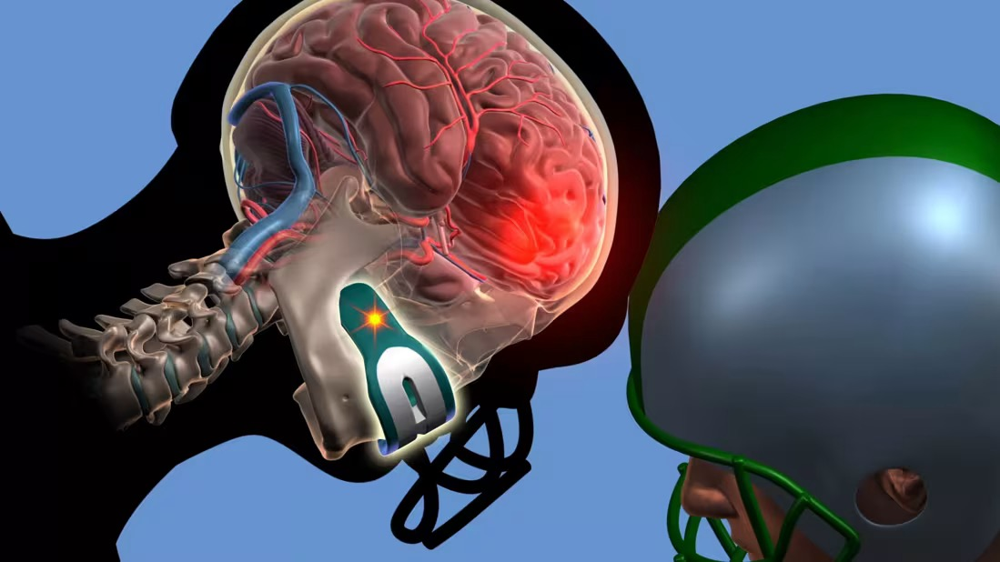

```{r}
#| label: Join datasets
#| include: false

library(tidyverse)
library(lubridate)
library(broom)
library(gt)
library(knitr) 
library(dplyr)

alpha <- 0.05
source_commit <- "bab356b2590cbc1f600054f0584509beb2af272d"
source_base <- paste0(
  "https://raw.githubusercontent.com/ali-ce/datasets/",
  source_commit, "/NFL/"
)

# Prefer bundled snapshots; a QMD downloaded alone uses the same pinned sources.
read_snapshot <- function(local_name, remote_name) {
  local_path <- file.path("data", local_name)
  source <- if (file.exists(local_path)) {
    local_path
  } else {
    paste0(source_base, remote_name)
  }
  read_csv(source, show_col_types = FALSE)
}

events_raw <- read_snapshot(
  "concussion-injuries.csv", "Concussion%20Injuries%202012-2014.csv"
)
players_raw <- read_snapshot(
  "head-injured-players.csv", "Head%20Injured%20Players.csv"
)

events <- events_raw |>
  mutate(record_date = dmy(Date))
players <- players_raw |>
  transmute(Player, birth_date = dmy(`Date of Birth`))

# Fail visibly if the expected source structure changes.
stopifnot(
  !anyNA(events$Player), !anyNA(players$Player),
  !anyDuplicated(players$Player),
  !anyNA(events$record_date), !anyNA(players$birth_date),
  !anyDuplicated(events[c("Player", "record_date")]),
  nrow(anti_join(events, players, by = "Player")) == 0
)

offensive_groups <- c("QB", "RB", "Receiver", "Offensive Line")

# Primary event definition, chosen before fitting any model:
# retain records classified as Head or Concussion, not flagged as unknown,
# and not flagged as preseason injuries.
classified_events <- events |>
  filter(`Reported Injury Type` %in% c("Head", "Concussion"))
known_events <- classified_events |>
  filter(`Unknown Injury?` == "No")
eligible_events <- known_events |>
  filter(`Pre-Season Injury?` == "No")

select_first <- function(event_data) {
  event_data |>
    arrange(Player, record_date, ID) |>
    group_by(Player) |>
    slice_head(n = 1) |>
    ungroup() |>
    left_join(players, by = "Player", relationship = "one-to-one") |>
    mutate(
      # Approximate decimal years at the associated game date.
      age = as.numeric(record_date - birth_date) / 365.25,
      position_group = case_when(
        Position == "Quarterback" ~ "QB",
        Position %in% c("Running Back", "Full Back") ~ "RB",
        Position %in% c("Wide Receiver", "Tight End") ~ "Receiver",
        Position %in% c("Offensive Tackle", "Guard", "Center") ~
          "Offensive Line",
        TRUE ~ NA_character_
      ),
      position_group = factor(position_group, levels = offensive_groups)
    )
}

first_eligible <- select_first(eligible_events)
stopifnot(
  nrow(first_eligible) == n_distinct(first_eligible$Player),
  !anyNA(first_eligible$age), all(first_eligible$age > 0)
)

offense <- first_eligible |>
  filter(!is.na(position_group))
offense_2012 <- offense |> filter(Season == "2012/2013")
offense_2013 <- offense |> filter(Season == "2013/2014")
stopifnot(
  all(table(offense_2012$position_group) >= 2),
  all(table(offense_2013$position_group) >= 2)
)

summarize_age <- function(data) {
  data |>
    group_by(position_group) |>
    summarise(
      n = n(), mean_age = mean(age), median_age = median(age),
      sd_age = sd(age), min_age = min(age), max_age = max(age),
      .groups = "drop"
    )
}

age_summary <- summarize_age(offense_2012)
fmt <- function(x, digits = 2) formatC(x, format = "f", digits = digits)
fmt_p <- function(x) {
  ifelse(x < 0.0001, "< 0.0001", paste0("= ", fmt(x, 4)))
}

theme_set(theme_minimal(base_size = 12))
theme_update(
  panel.grid.minor = element_blank(),
  plot.title.position = "plot",
  plot.title = element_text(face = "bold", color = "#17476b"),
  axis.title = element_text(face = "bold")
)

age_plot <- function(data, subtitle) {
  ggplot(data, aes(x = position_group, y = age)) +
    geom_boxplot(outlier.shape = NA, fill = "#d8e8f3", width = 0.55) +
    geom_point(
      position = position_jitter(width = 0.12, height = 0, seed = 2026),
      color = "#17476b", alpha = 0.65, size = 2
    ) +
    coord_flip() +
    labs(
      title = "Age at first qualifying injury record",
      subtitle = subtitle, x = NULL,
      y = "Approximate age at the associated game date (years)"
    )
}


```

# Introduction

Do offensive football positions differ in the ages of players appearing in head
injury records? In this module, we use public NFL records to compare four position
groups and examine how our conclusions depend on the question, the inclusion
rules, and the statistical method.

Our response is **approximate age at a player's first qualifying injury record
within this dataset**. We calculate age at the game date associated with that
record. This is not necessarily the player's first career injury or the exact
date of injury. Earlier injuries outside the observation window are unavailable.
The dataset also lacks an uninjured comparison group and complete exposure data
for all players, so this analysis cannot estimate concussion risk by position.



::: {.callout-note title="Before you begin"}
**Audience:** Students in an introductory statistics course who have encountered
hypothesis tests and confidence intervals.

**Prerequisites:** Means, standard deviations, boxplots, p-values, and basic R
syntax. The preparation code is supplied; data wrangling is not a prerequisite.

**Suggested time:** 75–90 minutes for the core activity, plus 30–45 minutes for the
optional season extension and sensitivity exercise.

**Software:** R, Quarto, and the R packages `tidyverse`, `lubridate`, `broom`, and
`gt`. Use dplyr 1.1.0 or later for the join validation shown below. RStudio is an
optional editor. Setup and rendering instructions appear at the end.
:::

::: {.callout-note title="Learning objectives"}
By the end of this module, you will be able to:

- Define the observational unit and distinguish recorded injury age from injury
  risk.
- Use summaries and diagnostic plots to assess whether a one-way ANOVA model is
  reasonable.
- Run and interpret ANOVA and Tukey pairwise comparisons in R.
- Explain how Welch ANOVA and Kruskal–Wallis address different questions or
  assumptions.
- Interpret Holm-adjusted pairwise Wilcoxon comparisons.
- Describe how inclusion decisions and sampling limitations affect conclusions.
:::

# Context and research question

A concussion is a traumatic brain injury that can affect brain function
([Mayo Clinic](https://www.mayoclinic.org/diseases-conditions/concussion/symptoms-causes/syc-20355594)).
Research in **NCAA Division I football players** has examined differences in
head-impact-related outcomes by position; that study provides background, rather
than direct evidence about the NFL sample used here
([Baugh et al., 2015](https://pmc.ncbi.nlm.nih.gov/articles/PMC4628259/)).

Our primary question is:

> Among included players whose first qualifying record occurred in 2012/2013,
> does mean age at that record differ across offensive position groups?

We use the following categories, based on the position listed on the selected
record:

| Group | Positions included |
|:--|:--|
| QB | Quarterback |
| RB | Running back and fullback |
| Receiver | Wide receiver and tight end |
| Offensive Line (OL) | Offensive tackle, guard, and center |

These combined groups keep the introductory comparison manageable. They still
contain players with different roles. Long snappers are excluded as special
teams players, rather than combined with offensive linemen. A listed position
does not identify what the player was doing when the injury occurred, and the
source's position classifications have not been independently verified.

# Data and inclusion rules

The files come from the public
[`ali-ce/datasets` NFL folder](https://github.com/ali-ce/datasets/tree/bab356b2590cbc1f600054f0584509beb2af272d/NFL).
The event file has `r nrow(events)` rows, and the player file has
`r nrow(players)` unique player names. The module uses a fixed repository version
so that later source changes do not silently alter the analysis.

We treat the files as a compiled classroom dataset. Its available fields do not
establish complete surveillance or independently verified clinical diagnoses.
In particular, the label `Head` is broader than a confirmed concussion. A
record flagged as not unknown is still only a classification supplied by the
source.

The primary analysis follows these rules in order:

1. Keep event records labeled `Head` or `Concussion`.
2. Exclude records flagged as unknown and records flagged as preseason injuries.
   Preseason flags matter because a record's listed game date may differ from the
   date of a preseason injury.
3. Select each player's earliest remaining record across the entire observation
   window. This happens before dividing the data by season.
4. Join the date of birth by player name and calculate approximate age as the
   number of days from birth to the associated game date divided by 365.25.
5. Keep players in the four offensive groups, then select the analysis season.

We recalculate age rather than reuse `Age first concussion (2012-2014)`: changing
the eligible events could change which record is first. These operational rules
are used consistently throughout the module. 

The processed data are available in the files [`offense_2012.csv`](offense_2012.csv) and [`offense_2013.csv`](offense_2013.csv)

```{r}
#| label: tbl-inclusion
#| echo: false
#| tbl-cap: "Sequential preparation counts. The unit changes from events to players after selecting the first qualifying record."

inclusion_counts <- tibble(
  Stage = c(
    "All source event records", "Labeled Head or Concussion",
    "Also not flagged as unknown", "Also not flagged as preseason",
    "First qualifying record per player", "Players in the four offensive groups",
    "Primary analysis: first qualifying record in 2012/2013"
  ),
  Unit = c(rep("Events", 4), rep("Players", 3)),
  Count = c(nrow(events), nrow(classified_events), nrow(known_events),
            nrow(eligible_events), nrow(first_eligible), nrow(offense),
            nrow(offense_2012))
)
inclusion_counts |> gt()
```

::: {.callout-note collapse="true" title="What do the variables mean?"}

| Variable | Meaning and use |
|:--|:--|
| `Player` | Source player name; the join key and observational unit after preparation. |
| `Date` / `record_date` | Source game-associated date, parsed as day/month/year. It is not independently verified as the injury date. |
| `Season` | Source season label; for example, `2012/2013`. |
| `Position` | Position listed on the selected event record. |
| `Reported Injury Type` | Source injury classification; eligibility is restricted to `Head` or `Concussion`. |
| `Unknown Injury?` | Source uncertainty flag; primary analysis requires `No`. |
| `Pre-Season Injury?` | Source preseason flag; primary analysis requires `No`. |
| `Date of Birth` / `birth_date` | Source date of birth, parsed as day/month/year. |
| `age` | Derived approximate age in years at the selected record's associated game date. |
| `position_group` | Derived offensive position category. |

The source provides player biography links, but its files do not fully document
the original injury collection and verification process. Retain this limitation
when reporting results; do not describe the files as an official NFL registry.

The join checks confirm unique names in the player file, no unmatched event
players, valid dates, and one selected record per player. Name-based matching can
still fail to distinguish different people with identical names. No statistical
test can establish that the source identities or dates are correct.
:::

::: {.callout-note collapse="true" title="Inspect the preparation in R"}
The complete preparation is in this QMD's setup chunk. Its essential sequence is:

```{r}
#| label: preparation-example
#| eval: false
eligible_events <- events |>
  filter(
    `Reported Injury Type` %in% c("Head", "Concussion"),
    `Unknown Injury?` == "No",
    `Pre-Season Injury?` == "No"
  )

# select_first() sorts eligible dates, keeps one record per player,
# joins birth dates, recalculates age, and assigns position groups.
first_eligible <- select_first(eligible_events)
offense <- first_eligible |> filter(!is.na(position_group))
offense_2012 <- offense |> filter(Season == "2012/2013")

```
:::

```{r}
#| echo: false
#| eval: false
write_csv(offense_2012, "offense_2012.csv")
write_csv(offense_2013, "offense_2013.csv")
```


# Part 1: Explore the 2012/2013 data

Each observation below represents one included player. Age is displayed to two
decimal places for comparison; this formatting does not imply that the injury
date is known precisely.

```{r}
#| label: tbl-age-summary
#| echo: false
#| tbl-cap: "Approximate age in years at the first qualifying record, 2012/2013."
age_summary |>
  gt() |>
  cols_label(position_group = "Position group", n = "Players",
             mean_age = "Mean", median_age = "Median", sd_age = "SD",
             min_age = "Min", max_age = "Max") |>
  fmt_number(columns = c(mean_age, median_age, sd_age, min_age, max_age),
             decimals = 2)
```

```{r}
#| label: fig-age-2012
#| echo: false
#| fig-cap: "Boxplots with all individual player ages. Horizontal positions show age; small vertical offsets separate overlapping points."
#| fig-alt: "Four horizontal boxplots with individual ages. The quarterback group has six players and the highest mean; running backs have the lowest mean."
age_plot(offense_2012, "2012/2013; one record per included player")
```

::: {.callout-note title="Think before testing"}
Record your answers before continuing:

1. Which group has the highest mean age? Which has the lowest?
2. How do the sample sizes and standard deviations compare?
3. Which observations warrant closer examination? Does an unusual age imply an
   error?
4. What information about the uninjured NFL population would help interpret
   these differences?
:::

# Part 2: One-way ANOVA and model checks

One-way **analysis of variance (ANOVA)** compares population means across groups.
Here, the explanatory variable is position group and the quantitative response
is approximate age at the selected record.

For $k = 4$ groups, the hypotheses are:

$$
\begin{align*}
&H_0: \mu_{\mathrm{OL}} = \mu_{\mathrm{QB}} =
\mu_{\mathrm{RB}} = \mu_{\mathrm{Receiver}}\\
&H_A: \text{Not all population means are equal.}
\end{align*}
$$

The population is conceptual: comparable players represented by this recording
process and these inclusion rules. This is not a random sample of all NFL
players. Inferential results are model-based classroom illustrations, and their
generalizability depends on assumptions the files cannot verify. Set
$\alpha = 0.05$ before examining the tests.

## Fit the model, then assess it before interpreting it

```{r}
#| label: fit-anova-2012
#| message: false
library(tidyverse)
offense_2012 <- read_csv("offense_2012.csv")
anova_2012 <- aov(age ~ position_group, data = offense_2012)
```

The classical ANOVA model assumes independent errors, approximately normal error
distributions within groups, and equal population error variances. The categorical
explanatory variable and quantitative response describe the model's setup.

- **Independence:** Selecting one record per player avoids treating repeat
  injuries from the same player as separate independent observations. It does not
  rule out dependence involving teammates, shared games, or reporting practices.
  Assess independence from the study design, not from the following plots.
- **Normality:** Examine residuals and group distributions for strong departures
  from the model. A boxplot flag is a prompt to investigate, not proof that ANOVA
  is invalid. Small groups give limited information about distribution shape.
- **Equal variances:** Compare group spreads, considering unequal sample sizes.
  The smallest group can make this assumption especially consequential.

```{r}
#| label: fig-diagnostics-2012
#| fig-cap: "Residual Q–Q plot and residuals versus fitted group means for the classical ANOVA model."
#| fig-alt: "Two diagnostic panels: a normal Q–Q plot of ANOVA residuals and residuals plotted against fitted group means."
#| fig-height: 4.5
old_par <- par(mfrow = c(1, 2))
plot(anova_2012, which = 2, id.n = 0)
plot(anova_2012, which = 1, id.n = 0)
par(old_par)
```

The fitted values are group means, so the second plot has four vertical bands.
Look for differences in vertical spread. The QQ plot checks the pooled residual
pattern; revisit the individual group plot because a pooled plot can hide group
differences.

In this sample, quarterbacks contribute only
`r age_summary$n[age_summary$position_group == "QB"]` observations, compared with
`r age_summary$n[age_summary$position_group == "Receiver"]` receivers. The ratio
of the largest to smallest sample SD is
`r fmt(max(age_summary$sd_age) / min(age_summary$sd_age))`. This is descriptive
evidence, not a pass/fail cutoff. In particular, six quarterback ages cannot
establish that the group's underlying distribution is normal.

::: {.callout-note title="Diagnostic checkpoint"}
Describe one feature that supports the model and one feature that deserves
caution. Which assumptions can these plots help assess, and which require
information about how the records were collected?

Do not use a normality test as an automatic switch between methods: a large
p-value does not verify normality, especially with a small group.
:::

## Read the ANOVA results

```{r}
#| label: anova-results-2012
anova_terms <- tidy(anova_2012)
summary(anova_2012)
```

```{r}
#| label: tbl-anova-2012
#| echo: false
#| tbl-cap: "Classical one-way ANOVA for the primary 2012/2013 sample."
anova_terms |>
  mutate(term = recode(term, position_group = "Position group")) |>
  gt() |>
  cols_label(term = "Source", df = "df", sumsq = "Sum of squares",
             meansq = "Mean square", statistic = "F", p.value = "p-value") |>
  fmt_number(columns = df, decimals = 0) |>
  fmt_number(columns = c(sumsq, meansq, statistic), decimals = 3) |>
  fmt_number(columns = p.value, decimals = 4) |>
  sub_missing(missing_text = "—")
```

```{r}
#| label: anova-inline-values
#| include: false
anova_group <- anova_terms |> filter(term == "position_group")
anova_error <- anova_terms |> filter(term == "Residuals")
eta_squared <- anova_group$sumsq / sum(anova_terms$sumsq)
```

The F-statistic compares between-group and within-group mean squares:

$$F = \frac{MS_{\text{Between}}}{MS_{\text{Within}}}
= \frac{`r fmt(anova_group$meansq, 3)`}{`r fmt(anova_error$meansq, 3)`}
= `r fmt(anova_group$statistic, 3)`. $$

The result is $F(`r anova_group$df`, `r anova_error$df`) =
`r fmt(anova_group$statistic, 3)`$, with $p `r fmt_p(anova_group$p.value)`$.
At the chosen threshold, we
`r if (anova_group$p.value < alpha) "reject" else "do not reject"` the
equal-means null hypothesis. The p-value is the probability, assuming the null
hypothesis and model assumptions, of an F-statistic at least as large as the one
observed. It is not the probability that the null hypothesis is true.

<!-- As a descriptive effect-size summary, $\eta^2 = -->
<!-- `r fmt(eta_squared, 3)`$: about `r fmt(100 * eta_squared, 1)`% of the observed -->
<!-- variation in age is accounted for by differences between these group means. -->
<!-- This is an in-sample description, not a causal effect of position. Pairwise -->
<!-- differences in years will make the magnitude easier to interpret. -->

::: {.callout-note collapse="true" title="How is F calculated?"}
For $k$ groups with total sample size $N$,

$$MS_{\text{Between}} =
\frac{\sum_{j=1}^{k} n_j(\bar X_j-\bar X_G)^2}{k-1},$$

$$MS_{\text{Within}} =
\frac{\sum_{j=1}^{k}\sum_{i=1}^{n_j}(X_{ij}-\bar X_j)^2}{N-k}.$$

Here, $n_j$ is the number of observations in group $j$, $\bar X_j$ is its mean,
$\bar X_G$ is the grand mean, and $X_{ij}$ is observation $i$ in group $j$.
When the denominator is positive, F is nonnegative and can be zero if all sample
means coincide. A large F indicates greater separation relative to within-group
variation; its evidential meaning depends on its reference distribution and
degrees of freedom.
:::

# Part 3: Tukey pairwise comparisons

ANOVA addresses whether all means are equal; it does not identify particular
pairs. **Tukey's HSD**, with the unequal-sample-size adjustment implemented in R,
compares all pairs using the classical model's pooled variance. The intervals
are approximate simultaneous 95% confidence intervals for the family of six
comparisons with these unequal group sizes, subject to the model assumptions.

```{r}
#| label: tukey-2012
tukey_2012 <- TukeyHSD(anova_2012, conf.level = 0.95)
tukey_table <- tidy(tukey_2012) |>
  select(contrast, estimate, conf.low, conf.high, adj.p.value)
```

```{r}
#| label: tbl-tukey-2012
#| echo: false
#| tbl-cap: "Tukey comparisons. Each estimate is the first named group's mean minus the second named group's mean, in years."
tukey_table |>
  gt() |>
  cols_label(contrast = "Comparison", estimate = "Difference (years)",
             conf.low = "Lower simultaneous 95% CI",
             conf.high = "Upper simultaneous 95% CI",
             adj.p.value = "Adjusted p-value") |>
  fmt_number(columns = c(estimate, conf.low, conf.high), decimals = 2) |>
  fmt_number(columns = adj.p.value, decimals = 4)
```

```{r}
#| label: tukey-inline-values
#| include: false
rb_qb <- tukey_table |> filter(contrast == "RB-QB")
stopifnot(nrow(rb_qb) == 1)
```

For `RB-QB`, the estimated difference is `r fmt(rb_qb$estimate)` years, with
simultaneous 95% interval (`r fmt(rb_qb$conf.low)`,
`r fmt(rb_qb$conf.high)`) and adjusted $p `r fmt_p(rb_qb$adj.p.value)`$.
Equivalently, the sample mean for quarterbacks is
`r fmt(-rb_qb$estimate)` years higher than for running backs. Reversing the
comparison gives interval (`r fmt(-rb_qb$conf.high)`,
`r fmt(-rb_qb$conf.low)`) years.

<!-- The width of the interval matters: the magnitude remains uncertain, and the -->
<!-- small quarterback group limits precision. Tukey's method does not correct -->
<!-- selection bias, dependence, or an inappropriate equal-variance model. -->

::: {.callout-note title="Check your interpretation"}
Why does a negative `RB-QB` estimate correspond to older quarterbacks? Which
intervals include zero? Explain why an interval that includes zero does not
establish that the two population means are identical.
:::

# Part 4: Alternative methods and their questions

## Welch ANOVA: keep the question about means

If equal variances are questionable, **Welch ANOVA** compares means without
assuming equal population variances. It still requires independent observations
and appropriate distributional conditions; it is not a remedy for every model
problem. R implements it with `oneway.test()`.

```{r}
#| label: welch-2012
welch_2012 <- oneway.test(
  age ~ position_group, data = offense_2012, var.equal = FALSE
)
welch_2012
```

Welch's test gives $F = `r fmt(unname(welch_2012$statistic), 3)`$ with
approximately `r fmt(unname(welch_2012$parameter[2]))` denominator degrees of
freedom and $p `r fmt_p(welch_2012$p.value)`$. Compare this with the classical
ANOVA result. Different handling of variance and uncertainty can matter when
sample sizes are small and unequal. Report that sensitivity rather than selecting
whichever method gives a preferred significance decision.

If Welch ANOVA is used as the primary model, its pairwise follow-up should also
allow unequal variances, for example Games–Howell comparisons. 

<!-- Classical Tukey -->
<!-- intervals are not its automatic follow-up. Computing Games–Howell is beyond this -->
<!-- introductory activity. -->

## Kruskal–Wallis: compare ranks

The **Kruskal–Wallis test** pools and ranks the observations, then compares rank
patterns across groups. It can be useful for ordinal responses or when strong
distributional concerns motivate a rank-based question. It requires independent
observations and is not assumption-free.

For this module, state the hypotheses as:

$$
\begin{align*}
&H_0: \text{The age distributions are identical across the four groups.}\\
&H_A: \text{The groups differ in their age distributions, as reflected in ranks.}
\end{align*}
$$

Kruskal–Wallis is particularly useful for location differences. With comparable
distribution shapes and spreads, it can be interpreted as a comparison of
locations, including medians. Without those conditions, do not describe it simply
as a test of equal medians: differing shapes or spreads can affect rank patterns,
and it does not detect every possible distributional difference.

```{r}
#| label: kruskal-2012
kruskal_2012 <- kruskal.test(age ~ position_group, data = offense_2012)
kruskal_2012
```

The test gives $H = `r fmt(unname(kruskal_2012$statistic), 3)`$ with
`r unname(kruskal_2012$parameter)` degrees of freedom and
$p `r fmt_p(kruskal_2012$p.value)`$. R uses an approximate chi-squared reference
distribution with a correction for ties. 

<!-- With a small group, treat asymptotic -->
<!-- inference cautiously; a permutation-based rank procedure is a possible advanced -->
<!-- extension, provided its exchangeability assumptions are justified. -->

```{r}
#| label: tbl-method-comparison
#| echo: false
#| tbl-cap: "Three methods applied to the same primary 2012/2013 sample. Their assumptions and targets differ."
tibble(
  Method = c("Classical ANOVA", "Welch ANOVA", "Kruskal–Wallis"),
  Target = c("Group means; equal variances", "Group means; unequal variances allowed",
             "Group rank patterns"),
  p_value = c(anova_group$p.value, welch_2012$p.value, kruskal_2012$p.value)
) |>
  mutate(`Decision at 0.05` = if_else(p_value < alpha, "Reject H0", "Do not reject H0")) |>
  gt() |>
  cols_label(p_value = "p-value") |>
  fmt_number(columns = p_value, decimals = 4)
```

::: {.callout-tip title="What should we conclude?"}
Under the primary inclusion rules, classical ANOVA and Kruskal–Wallis both give
p-values below 0.05, while Welch ANOVA does not. These results show sensitivity
to method; they do not prove that one test is correct or that another is wrong.
The tests use different assumptions, and the rank-based test changes the target
of inference.

The most defensible report combines the observed age differences, their
uncertainty, the small and unequal group sizes, and the dataset's limitations.
A p-value just above 0.05 does not establish equality, and one just below 0.05
does not establish a large or practically important effect.
:::

# Part 5: Rank-based pairwise comparisons

To practice pairwise rank-based inference, use **Wilcoxon rank-sum tests** with a
**Holm adjustment** across the six pairs. Holm's method controls the family-wise
error rate when the individual tests provide valid p-values. It does not adjust
for every analysis or inclusion rule explored elsewhere in the module.

```{r}
#| label: wilcoxon-2012
wilcoxon_2012 <- pairwise.wilcox.test(
  offense_2012$age, offense_2012$position_group,
  p.adjust.method = "holm", exact = FALSE
)
```

Here, `exact = FALSE` explicitly requests the normal approximation; the default
continuity correction is retained. Ages can be tied. Approximation quality is
also relevant for the small quarterback group. The Wilcoxon tests compare rank
patterns, not mean differences; location or median interpretations require
additional distributional assumptions.

```{r}
#| label: tbl-wilcoxon-2012
#| echo: false
#| tbl-cap: "Pairwise Wilcoxon rank-sum comparisons, with Holm adjustment across six pairs."
wilcoxon_table <- wilcoxon_2012$p.value |>
  as.data.frame() |>
  rownames_to_column("Group") |>
  pivot_longer(-Group, names_to = "Compared with", values_to = "p_value") |>
  filter(!is.na(p_value))

wilcoxon_table |>
  gt() |>
  cols_label(p_value = "Holm-adjusted p-value") |>
  fmt_number(columns = p_value, decimals = 4)
```

The smallest adjusted p-value is
`r fmt(min(wilcoxon_table$p_value), 4)`. No pair is significant at 0.05 under
this procedure. An global test and adjusted pairwise tests can reach different
decisions: they ask different questions and use different rejection rules.
An global rejection does not guarantee that this particular pairwise procedure
will identify a significant pair.

::: {.callout-note collapse="true" title="Why not Dunn's test?"}
Dunn's test is another common follow-up to Kruskal–Wallis. It retains the ranks
from the pooled sample; pairwise Wilcoxon tests rerank observations separately
within each pair. They are related approaches, not identical procedures.
We use pairwise Wilcoxon here because it is available in base R and illustrates
multiple-comparison adjustment without adding another package.
:::


# Your turn: the 2013/2014 cohort

Repeat the analysis for included players whose **first qualifying record in the
entire dataset** occurs in 2013/2014. Players already represented in 2012/2013
cannot enter this cohort, even if they later have another injury. It is not a
sample of all injured players in the later season.

::: {.callout-note collapse="true" title="Historical context and coverage"}
A 2013 rule restricted crown-of-helmet contact outside the tackle box
([NFL rule timeline](https://www.nfl.com/playerhealthandsafety/equipment-and-innovation/rules-changes/nfl-health-and-safety-related-rules-changes-since-2002)).
This provides background for separate season descriptions, not a design for
estimating a rule effect. Roster composition, reporting, exposure, and cohort
selection may also vary. Different significance decisions across seasons do not
establish a change in the position–age relationship; that would require a direct
comparison and additional assumptions. Neither analysis estimates a causal rule
effect.

The source's available dates are shown below. The 2014/2015 data end in November
2014 and are not a full season. The module therefore uses 2013/2014 for its guided
extension. Observed date ranges do not establish completeness for other seasons.

```{r}
#| label: tbl-source-coverage
#| echo: false
#| tbl-cap: "Observed game-associated dates in the source event file, before filtering."
events |>
  group_by(Season) |>
  summarise(First = min(record_date), Last = max(record_date),
            Events = n(), .groups = "drop") |>
  gt()
```
:::

## Student worksheet

Use the following prompts as a worksheet; answer before opening the instructor
notes.

1. **Define the data.** What does one row of `offense_2013` represent? Why is it
   different from all 2013/2014 injury events?
2. **Explore.** Report group sizes, means, medians, and SDs. Draw a boxplot with
   individual observations. Identify the smallest group.
3. **Specify.** State the ANOVA hypotheses and the significance threshold.
4. **Diagnose.** Fit the model, inspect its residuals and group spreads, and
   discuss independence from the recording process.
5. **Compare.** Report classical ANOVA, Welch ANOVA, and Kruskal–Wallis results.
   Explain what differs between their targets and assumptions.
6. **Follow up.** For teaching comparison, compute Tukey intervals and
   Holm-adjusted pairwise Wilcoxon p-values even if an global test is not
   significant. Label these as demonstrations; do not describe them as required
   follow-ups to a rejected null unless that null was actually rejected.
7. **Communicate.** Write a short conclusion including an observed difference
   in years, uncertainty, and one limitation. Can you infer a rule effect?

```{r}
#| label: extension-starter
#| eval: false

offense_2013 <- read_csv("offense_2013.csv")
summarize_age(offense_2013)
age_plot(offense_2013, "2013/2014 first-qualifying-record cohort")

anova_2013 <- aov(age ~ position_group, data = offense_2013)
plot(anova_2013, which = 2)
plot(anova_2013, which = 1)
summary(anova_2013)
TukeyHSD(anova_2013)

oneway.test(age ~ position_group, data = offense_2013, var.equal = FALSE)
kruskal.test(age ~ position_group, data = offense_2013)
pairwise.wilcox.test(
  offense_2013$age, offense_2013$position_group,
  p.adjust.method = "holm", exact = FALSE
)
```

# Discussion and takeaways

1. Could differences in roster ages or career lengths help explain the observed
   position differences? What additional data would you need to investigate?
2. Are outliers automatically errors? How would you distinguish a data error from
   a valid unusual observation?
3. When the within-group mean square is positive, what is the smallest possible
   F-statistic? What does a large F say about between- versus within-group
   variation?
4. Would a Kruskal–Wallis p-value of 0.053 establish equal age distributions?
5. Can an injury-record dataset without uninjured players identify the position
   with the greatest concussion risk?
6. Why might an global test reject while adjusted pairwise tests do not?
7. How could uncertain records and incomplete season coverage affect the
   conclusions?

The main sample shows differences in observed mean ages, but the inferential
conclusions depend on model assumptions and inclusion rules. Classical ANOVA
and Tukey comparisons address means under a pooled-variance model. Welch ANOVA
relaxes the equal-variance assumption. Rank-based procedures offer another
question, not an automatic correction for every limitation. None of these tests
turns injury records into a causal study or a representative estimate of NFL
injury risk.

# Instructor notes and answer guide

::: {.callout-note collapse="true" title="Core activity: suggested answers"}
**Exploration:** In the primary sample, quarterbacks have the highest mean age
and running backs the lowest. The sample sizes are 18 offensive linemen,
6 quarterbacks, 16 running backs, and 43 receivers. The small quarterback group
deserves particular attention. Unusual ages may reflect real variation in career
stage; investigate the record rather than automatically remove it.

**Diagnostics:** Group SDs and residual plots provide evidence about shape and
spread, but do not certify assumptions. One observation per player removes
within-player repetition. Shared games, teams, and reporting processes remain
possible sources of dependence. Formal inference also requires a defensible
population or model beyond the observed records.

**Tests:** Refer to the generated comparison table for exact p-values. Classical
ANOVA and Kruskal–Wallis reject at 0.05 under the primary rules; Welch does not.
This is an opportunity to discuss variance estimation, unequal group sizes,
and the distinction between means and rank patterns. It is not a competition to
find the smallest p-value.

**Pairwise comparisons:** The `RB-QB` Tukey interval excludes zero. A negative
estimate means the running-back mean is lower. All six Holm-adjusted Wilcoxon
p-values exceed 0.05. The global and pairwise methods have different hypotheses
and rejection regions, so their decisions need not coincide.

**Discussion:** With positive within-group mean square, the minimum F is zero.
A large F means greater separation relative to within-group variation, not a
large effect in years by itself. A p-value of 0.053 does not prove equality.
Injury risk requires appropriate population denominators or exposure information.
The sensitivity scenarios document uncertainty in the data definition; they do
not justify choosing eligibility rules after viewing p-values.
:::

::: {.callout-note collapse="true" title="2013/2014 extension: worked output and interpretation"}
```{r}
#| label: extension-answer-models
#| echo: false
summary_2013 <- summarize_age(offense_2013)
anova_2013 <- aov(age ~ position_group, data = offense_2013)
welch_2013 <- oneway.test(age ~ position_group, data = offense_2013)
kruskal_2013 <- kruskal.test(age ~ position_group, data = offense_2013)
tukey_2013 <- tidy(TukeyHSD(anova_2013))
wilcoxon_2013 <- pairwise.wilcox.test(
  offense_2013$age, offense_2013$position_group,
  p.adjust.method = "holm", exact = FALSE
)
summary_2013 |>
  gt() |>
  fmt_number(columns = c(mean_age, median_age, sd_age, min_age, max_age),
             decimals = 2)
```

```{r}
#| label: fig-extension-ages
#| echo: false
#| fig-cap: "Approximate ages for the 2013/2014 first-qualifying-record cohort."
#| fig-alt: "Boxplots and individual player ages for the four offensive groups in the 2013/2014 first-record cohort."
age_plot(offense_2013, "2013/2014; first qualifying record in the dataset")
```

```{r}
#| label: fig-extension-diagnostics
#| echo: false
#| fig-height: 4.5
#| fig-cap: "Residual diagnostics for the 2013/2014 extension."
#| fig-alt: "Normal Q–Q plot and residuals versus fitted group means for the 2013/2014 ANOVA model."
old_par <- par(mfrow = c(1, 2))
plot(anova_2013, which = 2, id.n = 0)
plot(anova_2013, which = 1, id.n = 0)
par(old_par)
```

```{r}
#| label: tbl-extension-tests
#| echo: false
tibble(
  Method = c("Classical ANOVA", "Welch ANOVA", "Kruskal–Wallis"),
  Statistic = c(tidy(anova_2013)$statistic[1],
                unname(welch_2013$statistic), unname(kruskal_2013$statistic)),
  p_value = c(tidy(anova_2013)$p.value[1], welch_2013$p.value,
              kruskal_2013$p.value)
) |>
  gt() |>
  cols_label(p_value = "p-value") |>
  fmt_number(columns = Statistic, decimals = 3) |>
  fmt_number(columns = p_value, decimals = 4)
```

```{r}
#| label: tbl-extension-tukey
#| echo: false
tukey_2013 |>
  select(contrast, estimate, conf.low, conf.high, adj.p.value) |>
  gt() |>
  cols_label(contrast = "Comparison", estimate = "Difference (years)",
             conf.low = "Lower simultaneous 95% CI",
             conf.high = "Upper simultaneous 95% CI",
             adj.p.value = "Adjusted p-value") |>
  fmt_number(columns = c(estimate, conf.low, conf.high), decimals = 2) |>
  fmt_number(columns = adj.p.value, decimals = 4)
```

```{r}
#| label: tbl-extension-wilcoxon
#| echo: false
wilcoxon_2013$p.value |>
  as.data.frame() |>
  rownames_to_column("Group") |>
  pivot_longer(-Group, names_to = "Compared with", values_to = "p_value") |>
  filter(!is.na(p_value)) |>
  gt() |>
  cols_label(p_value = "Holm-adjusted p-value") |>
  fmt_number(columns = p_value, decimals = 4)
```

```{r}
#| label: extension-inline-values
#| include: false
rb_qb_2013 <- tukey_2013 |> filter(contrast == "RB-QB")
```

There are `r nrow(offense_2013)` players, including only
`r sum(offense_2013$position_group == "QB")` quarterbacks. In the Q–Q and
group plots, consider possible tail departures and unequal spread; the small
quarterback group makes firm distributional judgments difficult. Independence
remains a design question rather than a graphical conclusion.

For example, the `RB-QB` mean difference is `r fmt(rb_qb_2013$estimate)` years,
with simultaneous 95% interval [`r fmt(rb_qb_2013$conf.low)`,
`r fmt(rb_qb_2013$conf.high)`]. Describe both the estimate and its uncertainty.
At 0.05, classical ANOVA
`r if (tidy(anova_2013)$p.value[1] < alpha) "rejects" else "does not reject"`
its null, Welch ANOVA
`r if (welch_2013$p.value < alpha) "rejects" else "does not reject"` its null,
and Kruskal–Wallis
`r if (kruskal_2013$p.value < alpha) "rejects" else "does not reject"` its null.
There are `r sum(tukey_2013$adj.p.value < alpha)` significant Tukey comparisons
and `r sum(wilcoxon_2013$p.value < alpha, na.rm = TRUE)` significant
Holm-adjusted Wilcoxon comparisons at this threshold.

None of these decisions establishes a rule effect. A comparison of p-values
across seasons does not test whether the position differences changed. The
earliest-eligible-record rule also creates cohorts with different selection
histories, and players' earlier injuries outside the source window are unknown.
:::

# Reproducibility and source notes

<!-- Download the QMD with its `data/` folder for an offline data snapshot. If only -->
<!-- the QMD is available, its setup reads the same files from the fixed GitHub -->
<!-- commit. Package installation and this fallback require internet access. -->

<!-- Run once in R if packages are missing: -->

<!-- ```{r} -->
<!-- #| label: install-packages -->
<!-- #| eval: false -->
<!-- install.packages(c("tidyverse", "lubridate", "broom", "gt")) -->
<!-- ``` -->

<!-- Then render from the folder containing the QMD: -->

<!-- ```{bash} -->
<!-- #| eval: false -->
<!-- quarto render offensive-position-head-injury.qmd -->
<!-- ``` -->

The supplied source files are unchanged snapshots retrieved on September 9,
2026, from commit `bab356b2590cbc1f600054f0584509beb2af272d`:

- [Concussion Injuries 2012–2014.csv](https://raw.githubusercontent.com/ali-ce/datasets/bab356b2590cbc1f600054f0584509beb2af272d/NFL/Concussion%20Injuries%202012-2014.csv)
- [Head Injured Players.csv](https://raw.githubusercontent.com/ali-ce/datasets/bab356b2590cbc1f600054f0584509beb2af272d/NFL/Head%20Injured%20Players.csv)

<!-- Public accessibility does not by itself establish redistribution permission. -->
<!-- The files do not supply a complete injury-data collection protocol or an -->
<!-- NFL-specific license statement. Source attribution and those unresolved -->
<!-- provenance details should accompany any public release of the data. -->

::: {.callout-note collapse="true" title="Software versions used for this render"}
```{r}
#| label: session-info
sessionInfo()
```
:::
